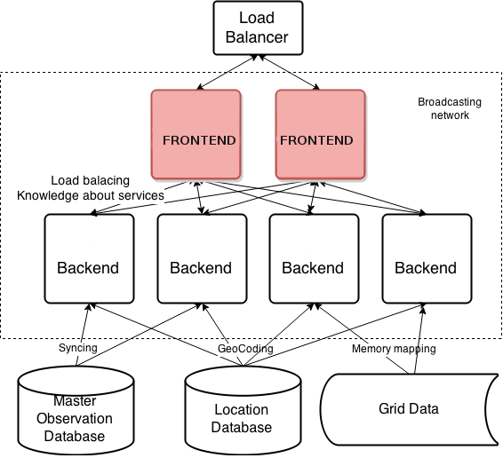

# SmartMet Server

[SmartMet Server](https://github.com/fmidev/smartmet-server) is a data
and product server for MetOcean data. It provides a high capacity and
high availability data and product server for MetOcean data. The
server is written in C++, since 2008 it has been in operational use by
the Finnish Meteorological Institute FMI.

# Introduction

In the SmartMet server, the backend servers provide different services
to the client. The figure below shows the architecture of the SmartMet
server. it Consists of frontend and backend servers, load balancer,
and database. Different backends may have different services.

The backend plugin provides APIs based on the services provided.
The backend-plugin starts the server in clustered backend mode.
Mandatory to use if the backend server needs to be part of the
frontend+backend cluster.  Usually this is the case.

When a client requests for a product to backend through the frontend,
the backend either responds with the ETag or with the product or the
ETag itself.

